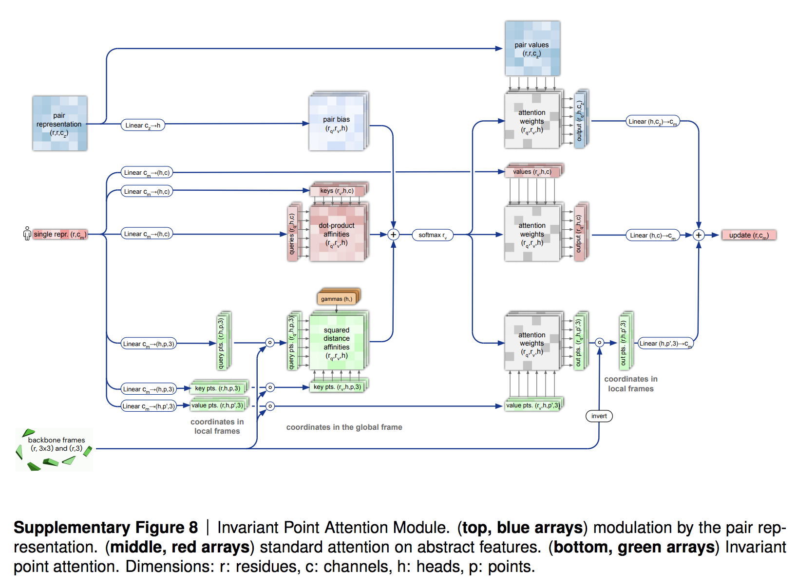

</img>

## Invariant Point Attention - Pytorch

Implementation of Invariant Point Attention as a standalone module, which was used in the structure module of <a href="https://github.com/deepmind/alphafold">Alphafold2</a> for coordinate refinement.

- [ ] enforce float32 for certain operations

## Install

```bash
$ pip install invariant-point-attention
```

## Usage

```python
import torch
from einops import repeat
from invariant_point_attention import InvariantPointAttention

attn = InvariantPointAttention(
    dim = 64,                  # single (and pairwise) representation dimension
    heads = 8,                 # number of attention heads
    scalar_key_dim = 16,       # scalar query-key dimension
    scalar_value_dim = 16,     # scalar value dimension
    point_key_dim = 4,         # point query-key dimension
    point_value_dim = 4        # point value dimension
)

single_repr   = torch.randn(1, 256, 64)      # (batch x seq x dim)
pairwise_repr = torch.randn(1, 256, 256, 64) # (batch x seq x seq x dim)
mask          = torch.ones(1, 256).bool()    # (batch x seq)

rotations     = repeat(torch.eye(3), '... -> b n ...', b = 1, n = 256)  # (batch x seq x rot1 x rot2) - example is identity
translations  = torch.zeros(1, 256, 3) # translation, also identity for example

attn_out = attn(
    single_repr,
    pairwise_repr,
    rotations = rotations,
    translations = translations,
    mask = mask
)

attn_out.shape # (1, 256, 64)
```

You can also use this module without the pairwise representations, which is very specific to the Alphafold2 architecture.

```python
import torch
from einops import repeat
from invariant_point_attention import InvariantPointAttention

attn = InvariantPointAttention(
    dim = 64,
    heads = 8,
    require_pairwise_repr = False   # set this to False to use the module without pairwise representations
)

seq           = torch.randn(1, 256, 64)
mask          = torch.ones(1, 256).bool()

rotations     = repeat(torch.eye(3), '... -> b n ...', b = 1, n = 256)
translations  = torch.randn(1, 256, 3)

attn_out = attn(
    seq,
    rotations = rotations,
    translations = translations,
    mask = mask
)

attn_out.shape # (1, 256, 64)
```

You can also use one IPA-based transformer block, which is an IPA followed by a feedforward. By default it will use post-layernorm as done in the official code, but you can also try pre-layernorm by setting `post_norm = False`

```python
import torch
from torch import nn
from einops import repeat
from invariant_point_attention import IPABlock

block = IPABlock(
    dim = 64,
    heads = 8,
    scalar_key_dim = 16,
    scalar_value_dim = 16,
    point_key_dim = 4,
    point_value_dim = 4
)

seq           = torch.randn(1, 256, 64)
pairwise_repr = torch.randn(1, 256, 256, 64)
mask          = torch.ones(1, 256).bool()

rotations     = repeat(torch.eye(3), 'r1 r2 -> b n r1 r2', b = 1, n = 256)
translations  = torch.randn(1, 256, 3)

block_out = block(
    seq,
    pairwise_repr = pairwise_repr,
    rotations = rotations,
    translations = translations,
    mask = mask
)

updates = nn.Linear(64, 6)(block_out)
quaternion_update, translation_update = updates.chunk(2, dim = -1) # (1, 256, 3), (1, 256, 3)

# apply updates to rotations and translations for the next iteration

```

## Toy Example

To run IPA on a toy task for denoising protein backbone coordinates, first install `pytorch3d` by running

```bash
$ conda install pytorch3d -c pytorch3d
```

Then you need to install `sidechainnet` with

```bash
$ pip install sidechainnet
```

Finally

```
$ python denoise.py
```

## Citations

```bibtex
@Article{AlphaFold2021,
    author  = {Jumper, John and Evans, Richard and Pritzel, Alexander and Green, Tim and Figurnov, Michael and Ronneberger, Olaf and Tunyasuvunakool, Kathryn and Bates, Russ and {\v{Z}}{\'\i}dek, Augustin and Potapenko, Anna and Bridgland, Alex and Meyer, Clemens and Kohl, Simon A A and Ballard, Andrew J and Cowie, Andrew and Romera-Paredes, Bernardino and Nikolov, Stanislav and Jain, Rishub and Adler, Jonas and Back, Trevor and Petersen, Stig and Reiman, David and Clancy, Ellen and Zielinski, Michal and Steinegger, Martin and Pacholska, Michalina and Berghammer, Tamas and Bodenstein, Sebastian and Silver, David and Vinyals, Oriol and Senior, Andrew W and Kavukcuoglu, Koray and Kohli, Pushmeet and Hassabis, Demis},
    journal = {Nature},
    title   = {Highly accurate protein structure prediction with {AlphaFold}},
    year    = {2021},
    doi     = {10.1038/s41586-021-03819-2},
    note    = {(Accelerated article preview)},
}
```
